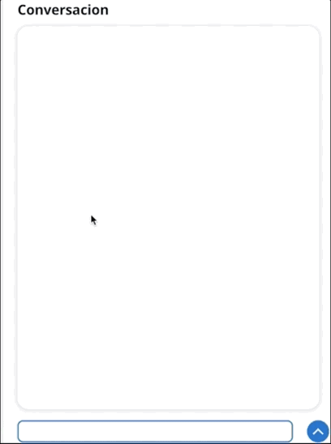

# De la mente a la pantalla: Genera imágenes en cualquier idioma. 

🇻🇪🇨🇱 [Dev.to](https://dev.to/elizabethfuentes12) [Linkedin](https://www.linkedin.com/in/lizfue/) [GitHub](https://github.com/elizabethfuentes12/) [Twitter](https://twitter.com/elizabethfue12) [Instagram](https://www.instagram.com/elifue.tech) [Youtube](https://www.youtube.com/channel/UCr0Gnc-t30m4xyrvsQpNp2Q)
[Linktr](https://linktr.ee/elizabethfuentesleone)

---


> 🧑🏻‍💻 Gracias a [ensamblador](https://github.com/ensamblador) por su ayuda desarrollando el frontend de esta aplicación.

---
## La Soloción




---

Esta solución esta creada para que la puedas desplegar en su totalidad en unos pocos minutos empleando [AWS Cloud Development Kit (AWS CDK)](https://docs.aws.amazon.com/cdk/v2/guide/home.html). 

## Temas que debes considerar antes de desplegar: 
- En el archivo [config.py](/cool-image-bot/config.py) esta la configuración del [Modelo stable diffusion 2.1](https://huggingface.co/stabilityai/stable-diffusion-2-1)  
 - Esta solución esta creada para desplegarse con CDK en la región de oregon (us-west-2).

 ```
export AWS_DEFAULT_REGION=us-west-2
```
- Emplea el tipo de instancia **ml.p3.2xlarge** por lo que debes garantizar tener la cuota de uso disponible, para revisar/solicitar sigue [estos pasos](https://repost.aws/knowledge-center/sagemaker-resource-limit-exceeded-error).

> 🚨 **Cuidado:** El uso de estas instancias no es parte de la capa gratuida, revisa los valores [aca](https://aws.amazon.com/es/sagemaker/pricing/)

## Paso 1: Despleguiegue inicial. 

En este paso vas a desplegar los siguientes servicios y los permisos necesarios para su interacción:

- Amazon S3 Bucket. 
- Amazon Lex - [bot](/cool-image-bot/bots).
- Amazon SageMaker [endpoint](/cool-image-bot/sagemaker). 
- Amazon [CloudFront](/cool-image-bot/s3_cloudfront). 
- Amazon Cognito [stack.](/cool-image-bot/cognito_stack/cognito_stack.py)  
- Amazon Lambda Function - [cool_image_hook.](/cool-image-bot/lambdas/code/cool_image_hook/lambda_function.py) 
- Amazon Lambda Function - [list_bots.](/cool-image-bot/lambdas/code/list_bots/lambda_function.py) 
- Amazon API Gateway - [webhooks](/cool-image-bot/apis/webhooks.py) 

>🚨 Antes de avanzar asegura de tener instalada la [AWS Command Line Interface (CLI)](https://docs.aws.amazon.com/es_es/cli/latest/userguide/cli-chap-welcome.html) y las [crenciales](https://docs.aws.amazon.com/es_es/cli/latest/userguide/getting-started-quickstart.html) de tu cuenta de AWS en el computador. 

✅ En el terminal, inicia clonando este repo:

```
git clone https://github.com/elizabethfuentes12/de-la-mente-a-la-pantalla.git
```

✅ Luego ve a la carpeta *cool-image-bot*: 

```
cd cool-image-bot
```

✅ Crea el ambiente virtual siguiendo los pasos en el [README.md](/cool-image-bot/README.md):

```
python3 -m venv .venv
```

```
source .venv/bin/activate
```
Si tienes windows: 

```
.venv\Scripts\activate.bat
```

✅ Instala los requerimientos:

```
pip install -r requirements.txt
```

✅ Sintentiza el template de Cloudformation con el siguiente comando: 

```
cdk synth
```

✅🚀 Y por ultimo el despliegue:

```
cdk deploy
```

Cuando termine de desplegarse verás un mensaje como este: 


## Paso 2: Configuración Frontend.

✅ Ve a la carpeta *front_end*:

```
cd front_end
```

Con los datos mostrados en el paso anterior crea un archivo con nombre **aws-exports.js** dentro de la carpeta **cool-image-bot/front_end/src/** con los siguientes valores: 

```
/* eslint-disable */
// WARNING: DO NOT EDIT. This file is automatically generated by AWS Amplify. It will be overwritten.

const awsmobile = {
    "aws_project_region": "us-west-2",
    "aws_cognito_identity_pool_id": "us-west-2:xxxxxxxx-xxxx-xxxx-xxxx-xxxxxxxxxxxx",
    "aws_cognito_region": "us-west-2",
    "aws_user_pools_id": "us-west-2_xxxxxxxxx",
    "aws_user_pools_web_client_id": "xxxxxxxxxxxxxxxxxxxxxxxxx",
    "aws_cognito_username_attributes": [
        "EMAIL"
    ],
    "aws_cognito_signup_attributes": [
        "NAME",
        "EMAIL"
    ],
    "aws_cognito_mfa_configuration": "OFF",
    "aws_cognito_mfa_types": [
        "SMS"
    ],
    "aws_cognito_password_protection_settings": {
        "passwordPolicyMinLength": 8,
        "passwordPolicyCharacters": [
        ]
    },
    "aws_cognito_verification_mechanisms": [
        "EMAIL"
    ],
    "aws_list_bots_api": "https://xxxxxxxxxx.execute-api.us-west-2.amazonaws.com/prod/"
};


export default awsmobile;

```

---

## Paso 3: Desplegar la APP Web.

La aplicación esta creada con React y puedes ver más información en el [README.md](/cool-image-bot/front_end/README.md):

✅ Iniciala en el ambiente de desarrollo de forma local con: 

```
npm start
```

✅ Construyela en el ambiente de producción con: 

```
npm run build
```

Una vez finalizado el paso anterior, en el terminal ve nuevamente a la carpeta *cool-image-bot*, y despliegua nuevamente la nueva configuración: 

```
cdk deploy
```

🤖 Listo!! has terminado de desplegar tu chatbot cool-image 👨🏻‍🎨! 

## Paso 4: Elimina la aplicación: 

Para eliminar todo lo creado anteriormente solo debes ingresar el siguiente comando: 

```
cdk destroy
```

----

## 🚨¿Te gusto? 👩🏻‍💻 ¿Tienes comentarios?🎤 cuéntamelo todo --> [acá](https://pulse.aws/survey/IVZZ290E)

----

## ¡Gracias!

Te dejo mis redes: 
🇻🇪🇨🇱 [Dev.to](https://dev.to/elizabethfuentes12) [Linkedin](https://www.linkedin.com/in/lizfue/) [GitHub](https://github.com/elizabethfuentes12/) [Twitter](https://twitter.com/elizabethfue12) [Instagram](https://www.instagram.com/elifue.tech) [Youtube](https://www.youtube.com/channel/UCr0Gnc-t30m4xyrvsQpNp2Q)
[Linktr](https://linktr.ee/elizabethfuentesleone)