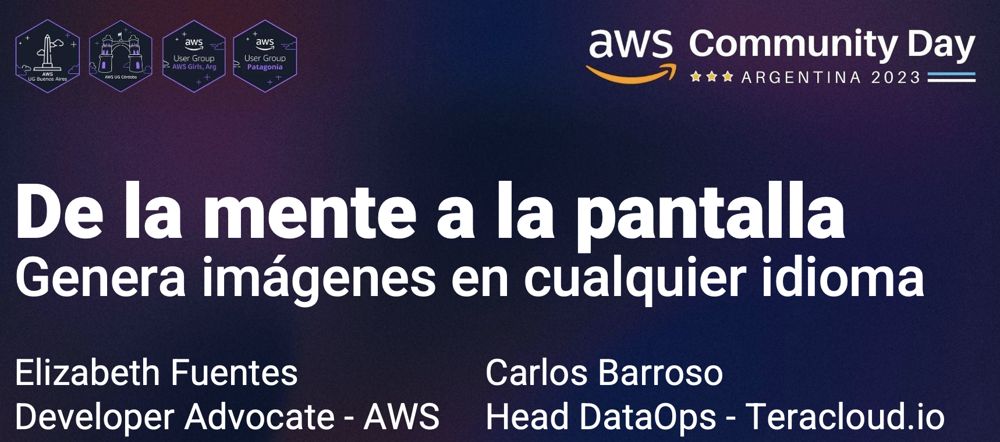

# De la mente a la pantalla: Genera imágenes en cualquier idioma. 

🇻🇪🇨🇱 [Dev.to](https://dev.to/elizabethfuentes12) [Linkedin](https://www.linkedin.com/in/lizfue/) [GitHub](https://github.com/elizabethfuentes12/) [Twitter](https://twitter.com/elizabethfue12) [Instagram](https://www.instagram.com/elifue.tech) [Youtube](https://www.youtube.com/channel/UCr0Gnc-t30m4xyrvsQpNp2Q)
[Linktr](https://linktr.ee/elizabethfuentesleone)

---



---
## La Soloción


---

Esta solución esta creada para que la puedas desplegar en su totalidad en unos pocos minutos empleando [AWS Cloud Development Kit (AWS CDK)](https://docs.aws.amazon.com/cdk/v2/guide/home.html). 

## Temas que debes considerar antes de desplegar: 
- En el archivo [config.py](/cool-image-bot/config.py) esta la configuración del [Modelo stable diffusion 2.1](https://huggingface.co/stabilityai/stable-diffusion-2-1)  
 - Esta solución esta creada para desplegarse con CDK en la región de oregon (us-west-2).

 ```
export AWS_DEFAULT_REGION=us-west-2
```
- Emplea el tipo de instancia **ml.p3.2xlarge** por lo que debes garantizar tener la cuota de uso disponible, para revisar/solicitar sigue [estos pasos](https://repost.aws/knowledge-center/sagemaker-resource-limit-exceeded-error).


## Paso 1: Desplegar el backend. 

En este paso vas a desplegar los siguientes servicios y los permisos necesarios para su interacción:

- Amazon S3 Bucket. 
- Amazon Lex - bot.
- Amazon SageMaker endpoint. 
- Amazon CloudFront. 
- Amazon Cognito [stack.](/cool-image-bot/cognito_stack/cognito_stack.py)  
- Amazon Lambda Function - [cool_image_hook.](/cool-image-bot/lambdas/code/cool_image_hook/lambda_function.py) 
- Amazon Lambda Function - [list_bots.](/cool-image-bot/lambdas/code/list_bots/lambda_function.py) 
- Amazon API Gateway - [webhooks](/cool-image-bot/apis/webhooks.py)  

Para esto cola este repo:

```
git clone https://github.com/elizabethfuentes12/de-la-mente-a-la-pantalla.git
```

Luego ve a la carpeta cool-image-bot: 

```
cd cool-image-bot
```

y sigue los pasos en el [README.md](/cool-image-bot/README.md). 


Cuando termine de desplegarse verás un mensaje como este: 


Los datos desplegados los vas a copiar en el [aws-exports.js](cool-image-bot/front_end/src/aws-exports.js): 

```
"aws_project_region": "us-west-2",
"aws_cognito_identity_pool_id": "us-west-2:xxxxxxxx-xxxx-xxxx-xxxx-xxxxxxxxxxxx",
"aws_cognito_region": "us-west-2",
"aws_user_pools_id": "us-west-2_xxxxxxxxx",
"aws_user_pools_web_client_id": "xxxxxxxxxxxxxxxxxxxxxxxxx",


"aws_list_bots_api": "https://xxxxxxxxxx.execute-api.us-west-2.amazonaws.com/prod/"
```


---

## Paso 2: Desplegar el frontend. 


Para esta parte ve a la carpeta front_end: 

```
cd front_end
```


----

## 🚨¿Te gusto? 👩🏻‍💻 ¿Tienes comentarios?🎤 cuéntamelo todo --> [acá](https://www.pulse.aws/survey/WC6WAFGM)

----

## ¡Gracias!

Te dejo mis redes: 
🇻🇪🇨🇱 [Dev.to](https://dev.to/elizabethfuentes12) [Linkedin](https://www.linkedin.com/in/lizfue/) [GitHub](https://github.com/elizabethfuentes12/) [Twitter](https://twitter.com/elizabethfue12) [Instagram](https://www.instagram.com/elifue.tech) [Youtube](https://www.youtube.com/channel/UCr0Gnc-t30m4xyrvsQpNp2Q)
[Linktr](https://linktr.ee/elizabethfuentesleone)